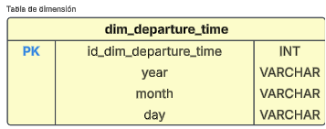

>
>
>Universidad San Carlos de Guatemala
>
>Facultad de Ingeniería 
>
>Escuela de Ciencias y Sistemas 
>
>Primer Semestre, 2025
>
>Laboratorio de Seminario de Sistemas 2

| Nombre                               | Carnet    |
| ------------------------------------ | --------- |
|   &nbsp; Melyza Alejandra Rodríguez Contreras | 201314821 |

# Práctica 1 

## Descripción general 
>  
>
>La práctica consiste en desarrollar el proceso ETL (extraer, transformar y cargar) de fuentes de datos de orígen. Cada parte del proceso debe ser realizado con precisión para poder adaptar los datos a un modelo de inteligencia de negocios (BI) mediante la implementación de un modelo de datos determinado, para después generar conocimiento a través de consultas analíticas que ayudarán a tomar decisiones importantes. 

## Modelo de datos 

|Modelo |Justificación|
|--|--|
|**Modelo estrella**|El modelo elegido para organizar la información fue el ***modelo estrella***.  La razón primordial de haber elegido este modelo, es la serie de ventajas que nos brinda al ser un diseño sencillo de plantear y de implementar, ofreciéndonos un desempeño superior al no tener propagaciones a varios niveles, como lo podrían tener otros modelos, por ejemplo, ***copo de nieve***.   Además, se logró identificar un proceso principal, lo cual representa la tabla de *hechos*, y varias dimensiones que interactuan con la misma y la complementa, las cuales son *dimensiones* y nos permiten filtrar la información facilmente para generar datos de interés.|

- **Descripción del modelo de datos**

**Tablas de dimensión**

**Tabla DimPilot**
|Campo|Tipo de dato|Llave|Descripción|
|--|--|--|--|
|*id_dim_pilot*|INT|PK|Llave primaria de la tabla|
|*pilot_name*|VARCHAR(100)||Nombre del piloto que lidera el vuelo|

 

**Tabla DimDepartureTime**
|Campo|Tipo de dato|Llave|Descripción|
|--|--|--|--|
|*id_dim_departure_time*|INT|PK|Llave primaria de la tabla|
|*year*|INT||Año en que se realiza el vuelo|
|*month*|INT||Mes en que se realiza el vuelo||
|*day*|INT||Día en que se realiza el vuelo||

 

**Tabla DimFlightArrival**
|Campo|Tipo de dato|Llave|Descripción|
|--|--|--|--|
|*id_dim_flight_arrival*|INT|PK|Llave primaria de la tabla|
|*airport_name*|VARCHAR(100)||Aeropuerto destino del vuelo|

 

**Tabla DimFlightDeparture**
|Campo|Tipo de dato|Llave|Descripción|
|--|--|--|--|
|*id_dim_flight_departure*|INT|PK|Llave primaria de la tabla|
|*airport_name*|VARCHAR(100)||Nombre del aeropuerto de salida del vuelo|
|*airport_country_code*|VARCHAR(10)||Código del país en ISO3 o ISO2 del país de salida del vuelo|
|*country_name*|VARCHAR(50)||Nombre del país de salida del vuelo|
|*airport_continent*|VARCHAR(50)||Código del continente del país de salida del vuelo|

 

**Tabla DimPassenger**
|Campo|Tipo de dato|Llave|Descripción|
|--|--|--|--|
|*id_dim_passenger*|INT|PK|Llave primaria de la tabla|
|*passenger_id*|VARCHAR(50)||ID único del pasajero|
|*first_name*|VARCHAR(50)||Nombre del pasajero|
|*last_name*|VARCHAR(50)||Apellido del pasajero|
|*gender*|VARCHAR(50)||Género del pasajero|
|*age*|INT||Edad en años del pasajero|
|*nationality*|VARCHAR(50)||Nacionalidad del pasajero|

 

**Tabla de hechos**

**Tabla FactFlight**
|Campo|Tipo de dato|Llave|Descripción|
|--|--|--|--|
|*id_fact_flight*|INT|PK|Llave primaria de la tabla|
|*passenger*|INT|PK|Pasajero del vuelo|
|*departure_time*|INT|PK|Fecha y hora del vuelo|
|*flight_departure*|INT|PK|Origen del vuelo|
|*flight_arrival*|INT|PK|Destino del vuelo|
|*pilot*|INT|PK|Piloto que lidera el vuelo|
|*status*|VARCHAR(50)||Identifica el estado actual del vuelo con respecto a la planificación.|

 

- **Representación gráfica del modelo de datos**

 

**Descripción de las relaciones entre las dimensiones y la tabla de hechos**

|Relación|Descripción|Representación|
|--|--|--|
|**dim_passenger ➡️ fact_flights**|Esta relación permite conocer al pasajero que viaja en el vuelo y conocer todos sus datos, esta relación es muy importante ya que nos da los distintos indicadores relacionados con las personas y las estadísticas de las mismas, por ejemplo, edades, nacionalidades, entre otras.| |
|**dim_departure_time ➡️ fact_flights**|Esta relación es la que describe el momento en el que ocurre el vuelo, nos brinda datos muy importantes y que nos pueden ayudar a tomar decisiones en base a temporadas del año en el que hay más vuelos, por ejemplo.||
|**dim_departure_flight ➡️ fact_flights**|Esta relación es la que nos indica la información de la salida del vuelo, nos puede ayudar a tomar decisiones en base||
|**dim_flight_arrival ➡️ fact_flights**|Esta relación nos brinda los datos del destino del vuelo. Con esta información podemos conocer los destinos más visitados y tomar decisiones en base a ello, por ejemplo, invertir más en turismo, entre otras cosas.| |
|**dim_pilo ➡️ fact_flights**|Es la información del piloto que dirige el vuelo. Es una dimensión que nos puede ayudar a deducir comisiones, metas de vuelo, determinar rangos, entre otras cosas relacionadas a los pilotos.| |

## Proceso ETL 

## Extracción 

## Transformación 

## Carga 

## Consultas analíticas 

