>
>
>Universidad San Carlos de Guatemala
>
>Facultad de Ingeniería 
>
>Escuela de Ciencias y Sistemas 
>
>Primer Semestre, 2025
>
>Laboratorio de Seminario de Sistemas 2

| Nombre                               | Carnet    |
| ------------------------------------ | --------- |
|   &nbsp; Melyza Alejandra Rodríguez Contreras | 201314821 |

# Práctica 1 

## Descripción general 
>  
>
>La práctica consiste en desarrollar el proceso ETL (extraer, transformar y cargar) de fuentes de datos de orígen. Cada parte del proceso debe ser realizado con precisión para poder adaptar los datos a un modelo de inteligencia de negocios (BI) mediante la implementación de un modelo de datos determinado, para después generar conocimiento a través de consultas analíticas que ayudarán a tomar decisiones importantes. 

## Modelo de datos 

|Modelo |Justificación|
|--|--|
|**Modelo estrella**|El modelo elegido para organizar la información fue el ***modelo estrella***. </br>La razón primordial de haber elegido este modelo, es la serie de ventajas que nos brinda al ser un diseño sencillo de plantear y de implementar, ofreciéndonos un desempeño superior al no tener propagaciones a varios niveles, como lo podrían tener otros modelos, por ejemplo, ***copo de nieve***. </br> Además, se logró identificar un proceso principal, lo cual representa la tabla de *hechos*, y varias dimensiones que interactuan con la misma y la complementa, las cuales son *dimensiones* y nos permiten filtrar la información facilmente para generar datos de interés.|

- **Descripción del modelo de datos**

**Tablas de dimensión**

**Tabla DimPilot**
|Campo|Tipo de dato|Llave|Descripción|
|--|--|--|--|
|*id_dim_pilot*|INT|PK|Llave primaria de la tabla|
|*pilot_name*|VARCHAR(100)||Nombre del piloto que lidera el vuelo|

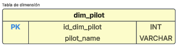 

**Tabla DimDepartureTime**
|Campo|Tipo de dato|Llave|Descripción|
|--|--|--|--|
|*id_dim_departure_time*|INT|PK|Llave primaria de la tabla|
|*year*|INT||Año en que se realiza el vuelo|
|*month*|INT||Mes en que se realiza el vuelo||
|*day*|INT||Día en que se realiza el vuelo||

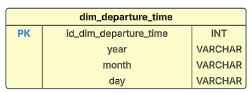 

**Tabla DimFlightArrival**
|Campo|Tipo de dato|Llave|Descripción|
|--|--|--|--|
|*id_dim_flight_arrival*|INT|PK|Llave primaria de la tabla|
|*airport_name*|VARCHAR(100)||Aeropuerto destino del vuelo|

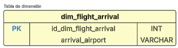 

**Tabla DimFlightDeparture**
|Campo|Tipo de dato|Llave|Descripción|
|--|--|--|--|
|*id_dim_flight_departure*|INT|PK|Llave primaria de la tabla|
|*airport_name*|VARCHAR(100)||Nombre del aeropuerto de salida del vuelo|
|*airport_country_code*|VARCHAR(10)||Código del país en ISO3 o ISO2 del país de salida del vuelo|
|*country_name*|VARCHAR(50)||Nombre del país de salida del vuelo|
|*airport_continent*|VARCHAR(50)||Código del continente del país de salida del vuelo|

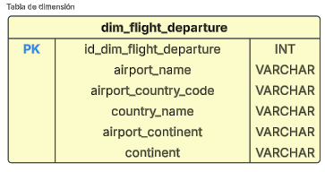 

**Tabla DimPassenger**
|Campo|Tipo de dato|Llave|Descripción|
|--|--|--|--|
|*id_dim_passenger*|INT|PK|Llave primaria de la tabla|
|*passenger_id*|VARCHAR(50)||ID único del pasajero|
|*first_name*|VARCHAR(50)||Nombre del pasajero|
|*last_name*|VARCHAR(50)||Apellido del pasajero|
|*gender*|VARCHAR(50)||Género del pasajero|
|*age*|INT||Edad en años del pasajero|
|*nationality*|VARCHAR(50)||Nacionalidad del pasajero|

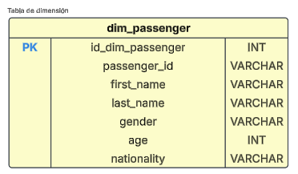 


**Tabla de hechos**

**Tabla FactFlight**
|Campo|Tipo de dato|Llave|Descripción|
|--|--|--|--|
|*id_fact_flight*|INT|PK|Llave primaria de la tabla|
|*passenger*|INT|PK|Pasajero del vuelo|
|*departure_time*|INT|PK|Fecha y hora del vuelo|
|*flight_departure*|INT|PK|Origen del vuelo|
|*flight_arrival*|INT|PK|Destino del vuelo|
|*pilot*|INT|PK|Piloto que lidera el vuelo|
|*status*|VARCHAR(50)||Identifica el estado actual del vuelo con respecto a la planificación.|

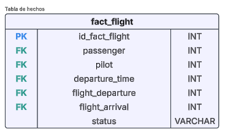 


- **Representación gráfica del modelo de datos**

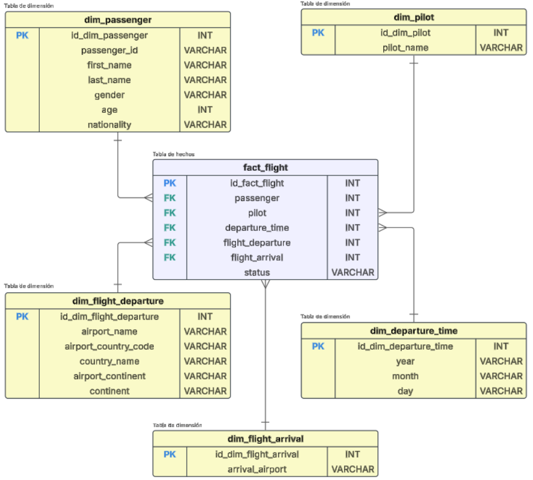 

**Descripción de las relaciones entre las dimensiones y la tabla de hechos**

|Relación|Descripción|Representación|
|--|--|--|
|**dim_passenger ➡️ fact_flights**|Esta relación permite conocer al pasajero que viaja en el vuelo y conocer todos sus datos, esta relación es muy importante ya que nos da los distintos indicadores relacionados con las personas y las estadísticas de las mismas, por ejemplo, edades, nacionalidades, entre otras.|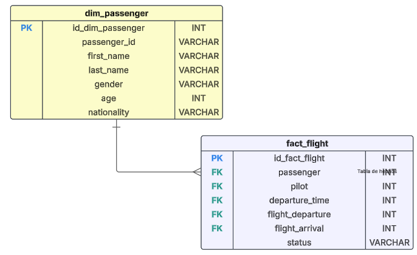 |
|**dim_departure_time ➡️ fact_flights**|Esta relación es la que describe el momento en el que ocurre el vuelo, nos brinda datos muy importantes y que nos pueden ayudar a tomar decisiones en base a temporadas del año en el que hay más vuelos, por ejemplo.|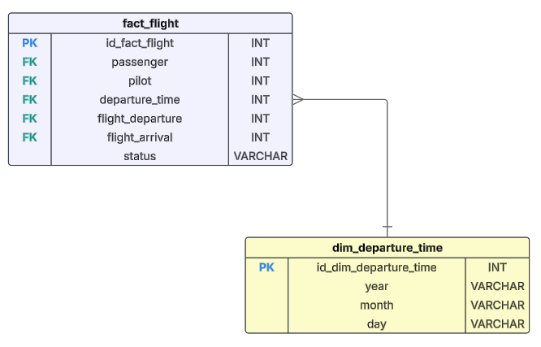|
|**dim_departure_flight ➡️ fact_flights**|Esta relación es la que nos indica la información de la salida del vuelo, nos puede ayudar a tomar decisiones en base|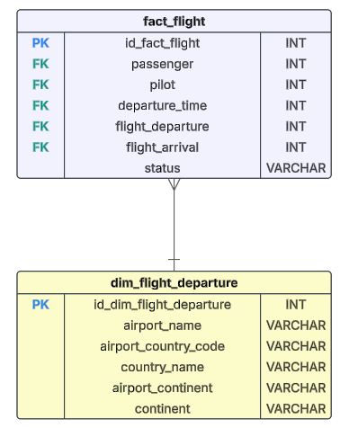|
|**dim_flight_arrival ➡️ fact_flights**|Esta relación nos brinda los datos del destino del vuelo. Con esta información podemos conocer los destinos más visitados y tomar decisiones en base a ello, por ejemplo, invertir más en turismo, entre otras cosas.|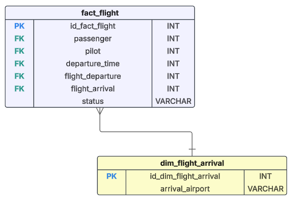 |
|**dim_pilo ➡️ fact_flights**|Es la información del piloto que dirige el vuelo. Es una dimensión que nos puede ayudar a deducir comisiones, metas de vuelo, determinar rangos, entre otras cosas relacionadas a los pilotos.|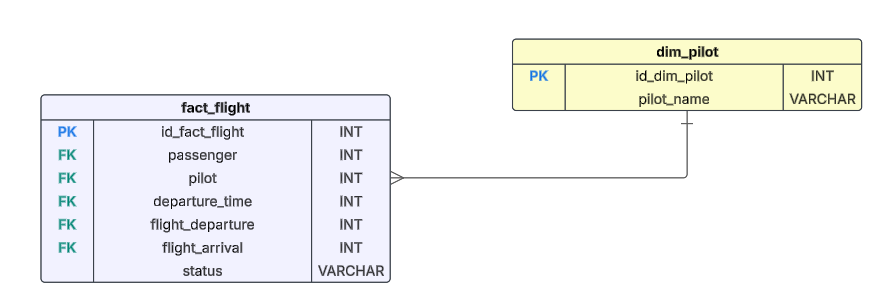 |

## Proceso ETL 

>  
>
> El proceso ***ETL (Extract, Transform, Load)*** es un método utilizado en la integración de datos para extraer información de diversas fuentes, transformarla según las necesidades del negocio y cargarla en un destino, como un almacén de datos. Extracción implica recuperar datos de bases de datos, APIs o archivos. Transformación aplica reglas, limpieza y agregaciones para estructurar los datos. Carga transfiere los datos procesados al destino final para su análisis. ETL es clave en business intelligence y big data, asegurando calidad y coherencia en los datos utilizados para la toma de decisiones empresariales.


|Tecnología|Descripción|
|--|--|
|</br></br>***PANDAS*** | Pandas es una biblioteca de Python utilizada para la manipulación y análisis de datos. Proporciona estructuras de datos eficientes, como DataFrame (tablas similares a hojas de cálculo) y Series (vectores unidimensionales), facilitando la limpieza, transformación y exploración de grandes volúmenes de información. Permite leer y escribir datos en múltiples formatos, como CSV, JSON, Excel y bases de datos SQL. Su integración con bibliotecas como NumPy y Matplotlib la hace ideal para análisis estadístico y visualización. Pandas es ampliamente utilizada en ciencia de datos, machine learning y procesamiento de datos estructurados.|

## Extracción 

- Código *python* utilizado para la extracción de datos desde el archivo origen. 

 **extraccion.py**  

```
import pandas as pd
from constantes import COLORES, FIN_LINEA

def extraer():
    path = input("INGRESE EL PATH DEL ARCHIVO CSV o presione ENTER [data.csv]: ")
    if(path == ""):
        path = "data.csv"
    try:
        df = pd.read_csv(path)
        print("\n" + COLORES["verde"] + str(len(df)) +  " DATOS EXTRAÍDOS CON ÉXITO\n\n" + FIN_LINEA)
        print(df)
        print("\n") 
        return df
    except Exception as e:
        print(f"ERROR AL EXTRAER INFORMACIÓN DEL ARCHIVO: {e}")
        return None
```

Dentro del menú de opciones generales, el apartado de extracción se encuentra en el número 3. 

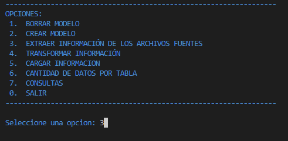 

Esta opción permite ingresar la ruta del archivo o bien solamente presionar ENTER y utilizar el archivo por defecto que se encuentra en el directorio del proyecto. 

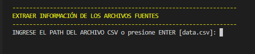 

Una vez que se decida la opción en cuanto al archivo de origen, se procede a cargar la información a memoria, retornando un ***dataframe***. 

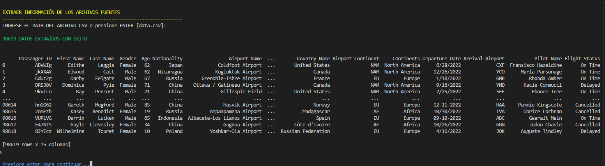 


> ***Nota:***
> Si el archivo no puede ser encontrado, se mostrará el error
> 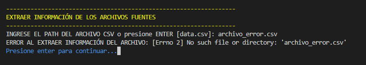 


> ***IMPORTANTE*** 
>
> Durante el desarrollo de la práctica podemos observar el fragmento de código COLORES["color"], esto nos ayuda a cambiar de color la letra en la terminal, lo cual provee de una interfaz más amigable y estética. 

## Transformación 

 **transformacion.py**  


 
```
import pandas as pd 
from constantes import COLORES, FIN_LINEA

def parse_dates(date_str):
        for fmt in ('%m/%d/%Y', '%m-%d-%Y'):
            try:
                return pd.to_datetime(date_str, format=fmt)
            except ValueError:
                continue
        return pd.NaT 

def transformar(df): 
    df['Arrival Airport'] = df['Arrival Airport'].replace(["0", "-"], "No especificado")
    # ----------------------------------------------------------------------
    # PILOTO  
    # ----------------------------------------------------------------------
    dim_pilot = df[['Pilot Name']].drop_duplicates().copy()
    dim_pilot['id_dim_pilot'] = range(1, len(dim_pilot) + 1)
    print(COLORES["verde"] +"")
    print("dim_pilot: ", len(dim_pilot) , " registros",FIN_LINEA)
    print(dim_pilot.head())
    
    # ----------------------------------------------------------------------
    # ARRIVAL AIRPORT
    # ----------------------------------------------------------------------
    dim_flight_arrival = df[['Arrival Airport']].drop_duplicates().copy()
    dim_flight_arrival['id_dim_flight_arrival'] = range(1, len(dim_flight_arrival) + 1)
    print(COLORES["verde"] +"")
    print("dim_flight_arrival: ", len(dim_flight_arrival) , " registros",FIN_LINEA)
    print(dim_flight_arrival.head())

    # ----------------------------------------------------------------------
    # DEPARTURE TIME
    # ----------------------------------------------------------------------
    df['Departure Date'] = df['Departure Date'].apply(parse_dates)
    dim_departure_time = df[['Departure Date']].drop_duplicates().copy()
    dim_departure_time['id_dim_departure_time'] = range(1, len(dim_departure_time) + 1)
    dim_departure_time['year']  = dim_departure_time['Departure Date'].dt.year
    dim_departure_time['month'] = dim_departure_time['Departure Date'].dt.month
    dim_departure_time['day']   = dim_departure_time['Departure Date'].dt.day
    print(COLORES["verde"] +"")
    print("dim_departure_time: ", len(dim_departure_time) , " registros",FIN_LINEA)
    print(dim_departure_time.head())

    # ----------------------------------------------------------------------
    # FLIGHT DEPARTURE
    # ----------------------------------------------------------------------
    dim_flight_departure = df[['Airport Name', 'Airport Country Code', 'Country Name', 'Airport Continent', 'Continents']].drop_duplicates().copy()
    dim_flight_departure['id_dim_flight_departure'] = range(1, len(dim_flight_departure) + 1)
    dim_flight_departure = dim_flight_departure.drop_duplicates(subset=['Airport Name'])
    print(COLORES["verde"] +"")
    print("dim_flight_departure: ", len(dim_flight_departure) , " registros", FIN_LINEA)
    print(dim_flight_departure.head())

    # ----------------------------------------------------------------------
    # PASSENGER
    # ----------------------------------------------------------------------
    
    dim_passenger = df[['Passenger ID', 'First Name', 'Last Name', 'Gender', 'Age', 'Nationality']].drop_duplicates().copy()
    dim_passenger['id_dim_passenger'] = range(1, len(dim_passenger) + 1)
    print(COLORES["verde"] +"")
    print("dim_passenger: ", len(dim_passenger) , " registros", FIN_LINEA)
    print(dim_passenger.head())
    print("\n")

    # ----------------------------------------------------------------------
    # FLIGHTS
    # ----------------------------------------------------------------------
    df['pilot']           = df['Pilot Name'].map(dim_pilot.set_index('Pilot Name')['id_dim_pilot'])
    df['departure_time']   = df['Departure Date'].map(dim_departure_time.set_index('Departure Date')['id_dim_departure_time'])
    df['passenger']   = df['Passenger ID'].map(dim_passenger.set_index('Passenger ID')['id_dim_passenger'])
    df['flight_departure']   = df['Airport Name'].map(dim_flight_departure.set_index('Airport Name')['id_dim_flight_departure'])
    df['flight_arrival']   = df['Arrival Airport'].map(dim_flight_arrival.set_index('Arrival Airport')['id_dim_flight_arrival'])
    df['status'] = df['Flight Status']
    fact_flight = df[['passenger', 'pilot','departure_time','flight_departure', 'flight_arrival','status']].copy()
    fact_flight['id_fact_flight'] = range(1, len(fact_flight) + 1)
    print(COLORES["verde"] +"")
    print("dim_passenger: ", len(fact_flight) , " registros", FIN_LINEA)
    print(fact_flight.head())
    print("\n")

    return [dim_pilot, dim_departure_time,dim_flight_arrival, dim_flight_departure, dim_passenger, fact_flight]
```

En esta parte estamos aplicando las diferentes reglas de transformación y limpieza de datos, es la opción 4 del menú principal. 


En cuanto elegimos la opción, se inicia el proceso de transformación, dando como resultado el conjunto de datos que ya han sido procesados, divididos en tablas que representan los datos que vamos a cargar. 

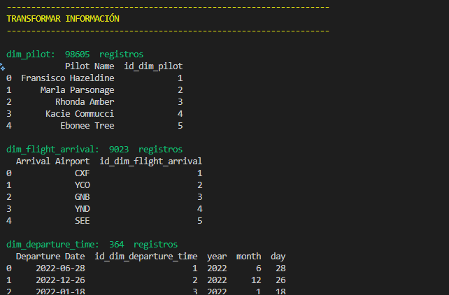


## Carga 
 **carga.py**  

```
from tqdm import tqdm
from constantes import COLORES, FIN_LINEA   # type: ignore
import db as database                       # type: ignore


def cargar(data):
    dim_pilot               = data[0]
    dim_departure_time      = data[1]
    dim_flight_arrival      = data[2]
    dim_flight_departure    = data[3]
    dim_passenger           = data[4]
    fact_flight             = data[5]
    errores = 0

    try: 
        conn = database.conectar_db()
        cursor = conn.cursor()
        # ----------------------------------------------------------------------
        # PILOTO  
        # ----------------------------------------------------------------------
        errores = 0
        for _, row in tqdm(dim_pilot.iterrows(), total=len(dim_pilot), desc=COLORES["verde"] + "CARGANDO DIM_PILOTOS:         " + FIN_LINEA):
            try:
                cursor.execute("""
                IF NOT EXISTS (SELECT 1 FROM DimPilot WHERE id_dim_pilot = ?)
                BEGIN
                    INSERT INTO DimPilot (id_dim_pilot, pilot_name)
                    VALUES (?, ?)
                END
            """, row['id_dim_pilot'], row['id_dim_pilot'], row['Pilot Name'])
            except Exception as e:
                errores += 1
                continue 
        print("PILOTOS           [" + COLORES["azul"] + "OK" + FIN_LINEA + "]")
        print("ERRORES         " , COLORES["rojo"] , errores , FIN_LINEA , "\n")
        


        # ----------------------------------------------------------------------
        # DEPARTURE TIME
        # ----------------------------------------------------------------------
        errores = 0
        for _, row in tqdm(dim_departure_time.iterrows(), total=len(dim_departure_time), desc=COLORES["verde"] + "CARGANDO DIM_DEPARTURE_TIME:  " + FIN_LINEA):
            try:
                cursor.execute("""
                    IF NOT EXISTS (SELECT 1 FROM DimDepartureTime WHERE id_dim_departure_time = ?)
                    BEGIN
                        INSERT INTO DimDepartureTime (id_dim_departure_time, [date], [year], [month], [day])
                        VALUES (?, ?, ?, ?, ?)
                    END
                """, row['id_dim_departure_time'], row['id_dim_departure_time'], row['Departure Date'], row['year'], row['month'], row['day'])
            except Exception as e:
                errores += 1
                continue 
        print("DEPARTURE TIME    [" + COLORES["azul"] + "OK" + FIN_LINEA + "]")
        print("ERRORES         " , COLORES["rojo"] , errores , FIN_LINEA , "\n")

        # ----------------------------------------------------------------------
        # FLIGHT ARRIVAL
        # ----------------------------------------------------------------------
        errores = 0
        for _, row in tqdm(dim_flight_arrival.iterrows(), total=len(dim_flight_arrival), desc=COLORES["verde"] + "CARGANDO DIM_FLIGHT_ARRIVAL:  " + FIN_LINEA):
            try:
                cursor.execute("""
                    IF NOT EXISTS (SELECT 1 FROM DimFlightArrival WHERE id_dim_flight_arrival = ?)
                    BEGIN
                        INSERT INTO DimFlightArrival (id_dim_flight_arrival, [airport_name])
                        VALUES (?, ?)
                    END
                """, row['id_dim_flight_arrival'], row['id_dim_flight_arrival'], row['Arrival Airport'])
            except Exception as e:
                errores += 1
                continue 
        print("FLIGHT ARRIVAL    [" + COLORES["azul"] + "OK" + FIN_LINEA + "]")
        print("ERRORES         " , COLORES["rojo"] , errores , FIN_LINEA , "\n")
        
        # ----------------------------------------------------------------------
        # FLIGHT DEPARTURE
        # ----------------------------------------------------------------------
        errores = 0
        for _, row in tqdm(dim_flight_departure.iterrows(), total=len(dim_flight_departure), desc=COLORES["verde"] + "CARGANDO DIM_FLIGHT_DEPARTURE:" + FIN_LINEA):
            try:
                cursor.execute("""
                    IF NOT EXISTS (SELECT 1 FROM DimFlightDeparture WHERE id_dim_flight_departure = ?)
                    BEGIN
                        INSERT INTO DimFlightDeparture (id_dim_flight_departure, [airport_name], [airport_country_code], [country_name], [airport_continent], [continents])
                        VALUES (?, ?, ?, ?, ?, ?)
                    END
                """, row['id_dim_flight_departure'], row['id_dim_flight_departure'], row['Airport Name'], row['Airport Country Code'], row['Country Name'], row['Airport Continent'], row['Continents'])
            except Exception as e:
                errores += 1
                continue 
        print("FLIGHT DEPARTURE  [" + COLORES["azul"] + "OK" + FIN_LINEA + "]")
        print("ERRORES         " , COLORES["rojo"] , errores , FIN_LINEA , "\n")
       
        # ----------------------------------------------------------------------
        # PASSENGER
        # ---------------------------------------------------------------------- 
        errores = 0                      
        for _, row in tqdm(dim_passenger.iterrows(), total=len(dim_passenger), desc=COLORES["verde"] + "CARGANDO DIM_PASSENGER:       " + FIN_LINEA):
            try:
                cursor.execute("""
                    IF NOT EXISTS (SELECT 1 FROM DimPassenger WHERE id_dim_passenger = ?)
                    BEGIN
                        INSERT INTO DimPassenger (id_dim_passenger, [passenger_id], [first_name], [last_name], [gender], [age], [nationality])
                        VALUES (?, ?, ?, ?, ?, ?, ?)
                    END
                """, row['id_dim_passenger'], row['id_dim_passenger'], row['Passenger ID'], row['First Name'], row['Last Name'], row['Gender'], row['Age'], row['Nationality'])
            
            except Exception as e:
                errores += 1
                continue  
        print("PASSENGER         [" + COLORES["azul"] + "OK" + FIN_LINEA + "]")
        print("ERRORES         " , COLORES["rojo"] , errores , FIN_LINEA , "\n")

        # ----------------------------------------------------------------------
        # FLIGHTS
        # ----------------------------------------------------------------------
        errores = 0
        for _, row in tqdm(fact_flight.iterrows(), total=len(fact_flight), desc=COLORES["verde"] + "CARGANDO FACT FLIGHTS:        " + FIN_LINEA):
            try:
                cursor.execute("""
                    INSERT INTO FactFlight ([passenger], [departure_time], [flight_departure], [flight_arrival], [pilot], [status])
                        VALUES (?, ?, ?, ?, ?,?)
                """, row['passenger'], row['departure_time'], row['flight_departure'], row['flight_arrival'], row['pilot'], row['status'])
            
            except Exception as e:
                errores  += 1
                print("Error al insertar datos en la fila:")
                print(row)
                print(f"Error: {e}")
                input("Presione ENTER para continuar")
                continue  
        print("FLIGHTS         [" + COLORES["azul"] + "OK" + FIN_LINEA + "]")
        print("ERRORES         " , COLORES["rojo"] , errores , FIN_LINEA , "\n")

    except Exception as e:
        print("Error al insertar datos en la fila:")
        print(row)
        print(f"Error: {e}")
    
```
Por medio del proceso de carga, trasladamos la data que fue previamente procesada en los dos pasos anteriores a la base de datos en disco. 

Esta opción se encuentra en el número 5, cuando presionamos dicha opción, empezará el proceso de carga de datos, mostrando en todo tiempo el estado de la carga y el número de registro que está trabajando en ese momento.

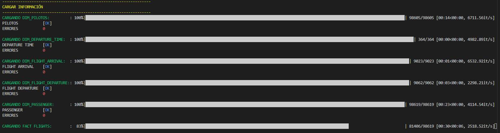 

- **Información de las tablas que fueron cargadad**

La opción 6 del menú general, nos permite ver el estado de las tablas que fueron cargadas. 

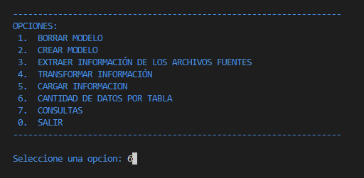 

Si seleccionamos dicha opción, podremos ver el nombre de la tabla y la cantidad de registros que posee en el momento en que consultamos. 

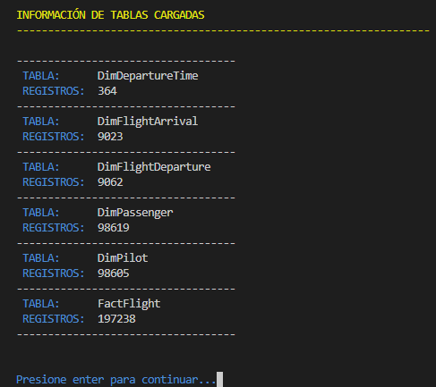 

## Consultas analíticas 

La sección de consultas, permite conocer información de interés acerca del estado de los datos que cargamos. 

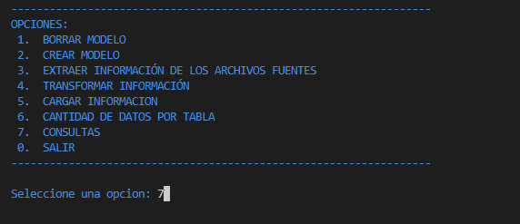 

Este apartado es muy importante y debe reflejarse de manera íntegra, ya que será el que ayude a los diferentes usuarios a tomar decisiones organizacionales en función de los resultados obtenidos. 

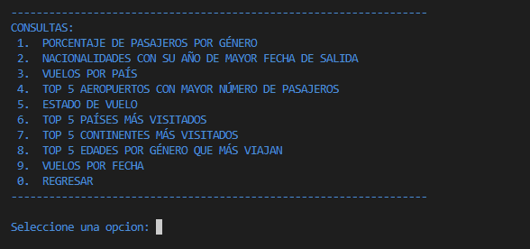 

A continuación, se detallan cada una de las consultas realizadas, así como el resultado obtenido según los datos actuales. 

 **consultas.py** 

- **CONSULTA 1:** Porcentaje de pasajeros por género

```
def consulta1(): 
    conn = conectar_db()
    cursor = conn.cursor()
    cursor.execute("""
        SELECT 
        gender AS GENERO, 
        COUNT(*) AS TOTAL, 
        COUNT(*) * 100.0 / (SELECT COUNT(*) FROM dbo.DimPassenger) AS PORCENTAJE
        FROM dbo.DimPassenger 
        GROUP BY gender;
    """)
    rows = cursor.fetchall()
    print("\n-----------------------------------")
    for row in rows: 
        print(COLORES["azul"] ,"GÉNERO:            " , FIN_LINEA, row.GENERO)
        print(COLORES["azul"] ,"TOTAL DE PASAJEROS:" , FIN_LINEA, row.TOTAL)
        print(COLORES["azul"] ,"PORCENTAJE:        " , FIN_LINEA, round(row.PORCENTAJE,2), "%")
        print("-----------------------------------")
    print("\n")
    cerrar_conexion_db(conn)
```

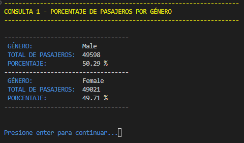 

- **CONSULTA 2:** Nacionalidades con su mes año de mayor fecha de salida

```
def consulta2(): 
    conn = conectar_db()
    cursor = conn.cursor()
    cursor.execute("SELECT * FROM actor where name_actor LIKE 'JOHN NA%'")
    rows = cursor.fetchall()
    for row in rows:
        print(row.id_actor)
    cerrar_conexion_db(conn)
```

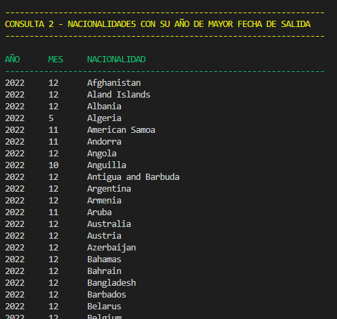 

- **CONSULTA 3:** COUNT de vuelos por país

```
def consulta3(): 
    conn = conectar_db()
    cursor = conn.cursor()
    cursor.execute("""
        SELECT b.country_name AS PAIS, b.airport_country_code AS CODIGO_PAIS,  count(*) AS TOTAL 
        FROM dbo.FactFlight a, dbo.DimFlightDeparture b 
        WHERE a.flight_departure = b.id_dim_flight_departure 
        GROUP BY b.country_name, b.airport_country_code
        ORDER BY b.country_name ASC 
        ;
    """)
    rows = cursor.fetchall()
    print(COLORES["verde"] ,"\nCOD.PAIS         VUELOS          PAIS" , FIN_LINEA)
    print(COLORES["verde"] + "------------------------------------------------------------------"        + FIN_LINEA)
    for row in rows: 
        print(row.CODIGO_PAIS, "\t\t", row.TOTAL, "\t\t", row.PAIS)
    print("\n")
    cerrar_conexion_db(conn)
```

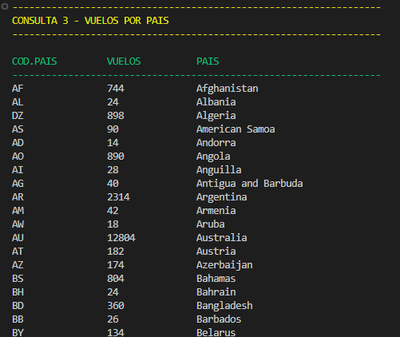 

- **CONSULTA 4:** Top 5 aeropuertos con mayor número de pasajeros

```
def consulta4(): 
    conn = conectar_db()
    cursor = conn.cursor()
    cursor.execute("""
        SELECT TOP 5
            a.airport_name AS AEROPUERTO, a.country_name AS PAIS, a.airport_country_code AS CODIGO_PAIS, count(*) AS TOTAL_VUELOS
        FROM 
            dbo.FactFlight b, 
            dbo.DimFlightDeparture a 
        WHERE a.id_dim_flight_departure = b.flight_departure 
        group by a.airport_name, a.country_name,  a.airport_country_code 
        ORDER BY TOTAL_VUELOS DESC 
        ;
    """)
    rows = cursor.fetchall()
    print(COLORES["verde"] ,"\nVUELOS\t PAIS\t CODIGO\t\t\t\tVUELOS" , FIN_LINEA)
    print(COLORES["verde"] + "------------------------------------------------------------------"        + FIN_LINEA)
    for row in rows: 
        print(row.TOTAL_VUELOS, "\t", row.CODIGO_PAIS, "\t", row.AEROPUERTO, "\t\t", row.PAIS, "\t\t")
    print("\n")
    cerrar_conexion_db(conn)
```

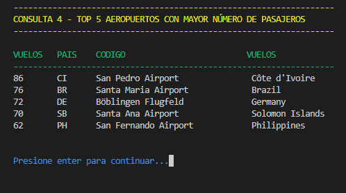 

- **CONSULTA 5:** COUNT divido por estado de vuelo

```
def consulta5(): 
    conn = conectar_db()
    cursor = conn.cursor()
    cursor.execute("""
        SELECT a.status AS STATUS, count(*) AS VUELOS FROM dbo.FactFlight a
        GROUP BY a.status
        ORDER BY VUELOS ASC;
    """)
    rows = cursor.fetchall()
    print(COLORES["verde"] ,"\nSTATUS\t\tTOTAL_VUELOS" , FIN_LINEA)
    print(COLORES["verde"] + "------------------------------------------------------------------"        + FIN_LINEA)
    for row in rows: 
        print(row.STATUS, "\t", row.VUELOS)
    print("\n")
    cerrar_conexion_db(conn)
```

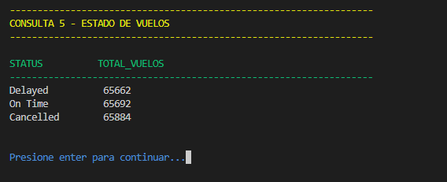 

- **CONSULTA 6:** Top 5 de los países más visitados

```
def consulta6(): 
    conn = conectar_db()
    cursor = conn.cursor()
    cursor.execute("""
        SELECT TOP 5
        b.airport_name AS DESTINO, count(*) AS VISITAS
        FROM dbo.FactFlight a , dbo.DimFlightArrival b 
        WHERE a.flight_arrival = b.id_dim_flight_arrival 
        group by b.airport_name
        ORDER BY VISITAS DESC;
    """)
    rows = cursor.fetchall()
    print(COLORES["verde"] ,"\nVISITAS\t DESTINO" , FIN_LINEA)
    print(COLORES["verde"] + "------------------------------------------------------------------"        + FIN_LINEA)
    for row in rows: 
        print(row.VISITAS, "\t", row.DESTINO)
    print("\n")
    cerrar_conexion_db(conn)
```

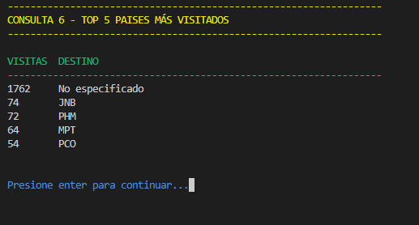 

- **CONSULTA 7:** Top 5 de los continentes más visitados

```
def consulta7(): 
    conn = conectar_db()
    cursor = conn.cursor()
    cursor.execute("SELECT * FROM actor where name_actor LIKE 'JOHN NA%'")
    rows = cursor.fetchall()
    for row in rows:
        print(row.id_actor)
    cerrar_conexion_db(conn)
```


 

- **CONSULTA 8:** Top 5 de edades divido por género que más viajan

```
def consulta8(): 
    conn = conectar_db()
    cursor = conn.cursor()
    cursor.execute("""
        WITH Ranking AS (
            SELECT 
                b.gender AS GENERO, 
                b.age AS EDAD, 
                COUNT(*) AS VIAJES,
                ROW_NUMBER() OVER (PARTITION BY b.gender ORDER BY COUNT(*) DESC) AS rn
            FROM dbo.FactFlight a
            JOIN dbo.DimPassenger b ON a.passenger = b.id_dim_passenger
            GROUP BY b.gender, b.age
        )
        SELECT GENERO, EDAD, VIAJES
        FROM Ranking
        WHERE rn <= 5
        ORDER BY GENERO ASC, VIAJES DESC;
    """)
    rows = cursor.fetchall()
    print(COLORES["verde"] ,"\nGENERO\t EDAD\t VIAJES" , FIN_LINEA)
    print(COLORES["verde"] + "------------------------------------------------------------------"        + FIN_LINEA)
    for row in rows: 
        print(row.GENERO, "\t", row.EDAD, "\t", row.VIAJES)
    print("\n")
    cerrar_conexion_db(conn)
```

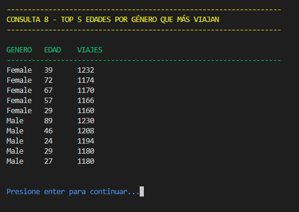 

- **CONSULTA 9:** COUNT de vuelos por MM-YYYY

```
def consulta9(): 
    conn = conectar_db()
    cursor = conn.cursor()
    cursor.execute("""
        SELECT 
            b.month as MES, 
            b.year AS ANIO, 
            COUNT(*) AS TOTAL_VUELOS
        FROM dbo.FactFlight a, dbo.DimDepartureTime b
        WHERE a.departure_time = b.id_dim_departure_time
        GROUP BY b.year, b.month
        ORDER BY b.year DESC, b.month ASC;
    """)
    rows = cursor.fetchall()
    print(COLORES["verde"] ,"\nMES\t ANIO\t VUELOS" , FIN_LINEA)
    print(COLORES["verde"] + "------------------------------------------------------------------"        + FIN_LINEA)
    for row in rows: 
        print(row.MES, "\t", row.ANIO, "\t", row.TOTAL_VUELOS)
    print("\n")
    cerrar_conexion_db(conn)
```

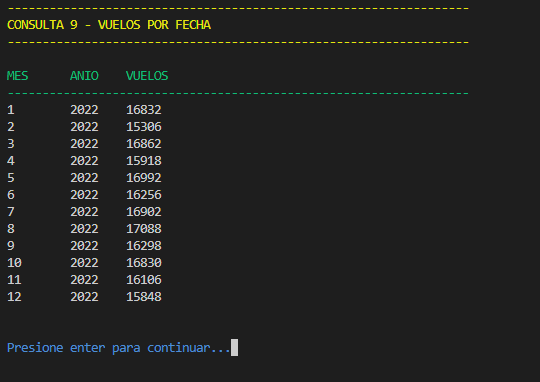 
