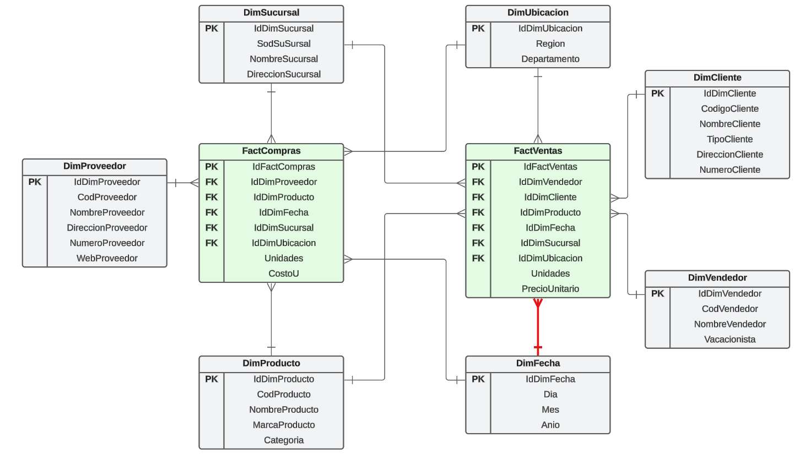

>
>
>Universidad San Carlos de Guatemala
>
>Facultad de Ingeniería 
>
>Escuela de Ciencias y Sistemas 
>
>Primer Semestre, 2025
>
>Laboratorio de Seminario de Sistemas 2


| Nombre                               | Carnet    |
| ------------------------------------ | --------- |
|   &nbsp; Melyza Alejandra Rodríguez Contreras | 201314821 |


# Proyecto 1

## Descripción general 

>  
>
>***SG-Food***, una megaempresa dedicada a la compra, distribución y comercialización de productos de diversas marcas y categorías que requiere una solución de *Business Intelligence* para optimizar sus procesos de análisis de ventas e inventarios. Debido al crecimiento significativo en sus operaciones, el sistema actual presenta tiempos de respuesta lentos y problemas en la base de datos principal. Este proyecto propone implementar una solución de BI que optimice los tiempos de respuesta y reduzca la carga sobre la base de datos central, permitiendo un análisis eficiente de datos de compras y ventas.

## Arquitectura de la solución 

A continuación, se presenta la arquitectura de la solución propuesta durante el desarrollo de este proyecto. 

 

## Resumen de tecnologías utilizadas 

| Tecnología | Versión | Descripción | 
| -- | -- | -- |
|   <br> **Sistema operativo Windows**| 11| Windows es un sistema operativo gráfico desarrollado por Microsoft, conocido por su interfaz amigable y su amplia compatibilidad con software y hardware. Es utilizado en computadoras personales, servidores y dispositivos móviles. Su versión más popular es Windows 10, aunque Windows 11 también está disponible con mejoras de rendimiento y seguridad.|
|   <br> **IDE Microsoft Visual Studio**|2022 |Microsoft Visual Studio es un entorno de desarrollo integrado (IDE) utilizado para crear aplicaciones, sitios web y servicios. Soporta múltiples lenguajes de programación como C#, C++, JavaScript y Python. Ofrece herramientas de depuración, diseño, control de versiones y compilación, facilitando el desarrollo de software eficiente y robusto. |
|   <br> **Extensión SQL Server Integration Services Projects 2022**|1.5 | La extensión SQL Server Integration Services Projects 2022 para Visual Studio permite diseñar, implementar y administrar paquetes de Integration Services (SSIS). Facilita la creación de flujos de trabajo ETL, como transformaciones y carga de datos, proporcionando herramientas para la depuración, prueba y despliegue en entornos de SQL Server.|
|    <br> **SQL Server 2022 (RTM)**|16.0.1000 | SQL Server 2022 (RTM) es la versión más reciente del sistema de gestión de bases de datos de Microsoft. Ofrece mejoras en rendimiento, seguridad y escalabilidad, con nuevas características como la integración con Azure, capacidades avanzadas de inteligencia artificial, y optimización de consultas y almacenamiento en la nube.|
|   <br> **Postgres SQL con Supabase**| 15.8|Supabase es una plataforma que proporciona backend como servicio, basada en PostgreSQL. Ofrece bases de datos gestionadas, autenticación, almacenamiento y funciones en tiempo real. Al usar SQL en Supabase, puedes interactuar directamente con la base de datos PostgreSQL mediante consultas, vistas, funciones y triggers, todo desde su interfaz. |


## Proceso ETL 

### Orígen de datos 

 **.comp** 

>Los archivos con la extensión ***.comp*** contienen las información relacionada con las diferentes adquisiciones o compras realizadas a proveedores por parte de ***SG-Food***.


|Campos del archivo| Ejemplo del campo|
|--|--|
| Fecha|11/01/2020|
| CodProveedor|P0001|
| NombreProveedor|CESAR ADRIAN GERONIS ROMERO|
| DireccionProveedor|10 avenida 4-54 zona 12|
| NumeroProveedor|42022451|
| WebProveedor|S|
| CodProducto|AC00005|
| NombreProducto|Gaseosa Postobón|
| MarcaProducto|BRETANA
| Categoria|Bebidas|
| SodSucursal|S0001|
| NombreSucursal|Sucursal1|
| DireccionSucursal|kilometro 20 carretera al pacifico, parque industrial unisur, local no. 1, delta barcenas,|
| Region|Suroccidente1|
| Departamento|Quetzaltenango|
| Unidades|583|
| CostoU|508.35|

 **.vent** 

>Los archivos con extensión ***.vent*** contienen la información relacionada con las ventas realizadas por la megacorporación ***SG-Food*** a los diferentes clientes con los que cuentan en sus carteras. 

|Campos del archivo| Ejemplo del campo|
|--|--|
| Fecha|14/01/2020|
| CodigoCliente|C0001|
| NombreCliente|Jose Arturo Bayardi Lozano|
| TipoCliente|Minorista|
| DireccionCliente|calzada atanasio tzul 22-00 zona 12, el cortijo ii, oficina 100|
| NumeroCliente|69555645|
| CodVendedor|V0001|
| NombreVendedor|Nelson Mario Caffera Morandi|
| Vacacionista|1|
| CodProducto|AC00003|
| NombreProducto|Queso Camembert kaserei champiñón |
| MarcaProducto|MONTICELLO|
| Categoria|Charcutería|
| SodSucursal|S0001|
| NombreSucursal|Sucursal1|
| DireccionSucursal|kilometro 20 carretera al pacifico, parque industrial unisur, local no. 1, delta barcenas,|
| Region|Suroccidente1|
| Departamento|Quetzaltenango|
| Unidades|34|
| PrecioUnitario|398.27|


### Estrategia de tablas pivote 

Para hacer más sencillo el proceso ETL, se utilizó la estrategia de creación de tablas *pivote*, estas tablas se definen como herramientas auxiliares que nos ayudarán a realizar de mejor manera el proceso de transformación, ya que cargamos todos los datos en el estado original en que fueron definidos en el archivo fuente, esto, nos permitirá detectar errores en los registros y áreas de transformación. 

A continuación, se detalla los motores de base de datos utilizados y la definición de las diferentes tablas utilizadas para la implementación de la estrategia de tablas pivote en los dos fabricantes de base de datos utilizados. 

- **SQL Server**

 


|Tabla|Descripción|
|--|--|
| <br> **compras_pivote**|Tabla auxiliar para registrar los datos de las compras en la forma en que fueron representados en los archivos de orígen de datos. Esta tabla está asociada al contenido de los archivos ***.comp***. Esta tabla está implementada en **SQL Server**.|
| <br> **ventas_pivote**|Tabla auxiliar para registrar los datos de las ventas realizadas a los clientes, en la forma en que fueron representados en los archivos de orígen de datos. Esta tabla está asociada al contenido de los archivos ***.vent***. Esta tabla está implementada en **SQL Server**.|


**DDL de las tablas:**
```
CREATE TABLE compras_pivote (
	Fecha				NVARCHAR(200)	NULL	,  
	CodProveedor		NVARCHAR(200)	NULL	,  
	NombreProveedor		NVARCHAR(200)	NULL	,  
	DireccionProveedor	NVARCHAR(200)	NULL	,  
	NumeroProveedor		NVARCHAR(200)	NULL	,  
	WebProveedor		NVARCHAR(200)	NULL	,  
	CodProducto			NVARCHAR(200)	NULL	,  
	NombreProducto		NVARCHAR(200)	NULL	,  
	MarcaProducto		NVARCHAR(200)	NULL	,  
	Categoria			NVARCHAR(200)	NULL	,  
	SodSuSursal			NVARCHAR(200)	NULL	,  
	NombreSucursal		NVARCHAR(200)	NULL	,  
	DireccionSucursal	NVARCHAR(200)	NULL	,  
	Region				NVARCHAR(200)	NULL	,  
	Departamento		NVARCHAR(200)	NULL	,  
	Unidades			NVARCHAR(200)	NULL	,  
	CostoU				NVARCHAR(200)	NULL 
);

CREATE TABLE ventas_pivote (
	Fecha				NVARCHAR(200)	NULL	,  
	CodigoCliente		NVARCHAR(200)	NULL	,  
	NombreCliente		NVARCHAR(200)	NULL	,  
	TipoCliente			NVARCHAR(200)	NULL	,  
	DireccionCliente	NVARCHAR(200)	NULL	,  
	NumeroCliente		NVARCHAR(200)	NULL	,  
	CodVendedor			NVARCHAR(200)	NULL	,  
	NombreVendedor		NVARCHAR(200)	NULL	,  
	Vacacionista		NVARCHAR(200)	NULL	,  
	CodProducto			NVARCHAR(200)	NULL	,  
	NombreProducto		NVARCHAR(200)	NULL	,  
	MarcaProducto		NVARCHAR(200)	NULL	,  
	Categoria			NVARCHAR(200)	NULL	,  
	SodSuSursal			NVARCHAR(200)	NULL	,  
	NombreSucursal		NVARCHAR(200)	NULL	,  
	DireccionSucursal	NVARCHAR(200)	NULL	,  
	Region				NVARCHAR(200)	NULL	,  
	Departamento		NVARCHAR(200)	NULL	,  
	Unidades			NVARCHAR(200)	NULL	,  
	PrecioUnitario		NVARCHAR(200)	NULL  
);
```

- **Postgres**

 

|Tabla|Descripción|
|--|--|
| <br> **compras_pivote**|Tabla auxiliar para registrar los datos de las compras en la forma en que fueron representados en los archivos de orígen de datos. Esta tabla está asociada al contenido de los archivos ***.comp***. Esta tabla está implementada en **Postgres** con **Supabase**.|
| <br> **ventas_pivote**|Tabla auxiliar para registrar los datos de las ventas realizadas a los clientes, en la forma en que fueron representados en los archivos de orígen de datos. Esta tabla está asociada al contenido de los archivos ***.vent***. Esta tabla está implementada en **Postgres** con **Supabase**.|

**DDL de las tablas:**

```
CREATE TABLE compras_pivote (
    fecha                VARCHAR(200),  
    cod_proveedor        VARCHAR(200),  
    nombre_proveedor     VARCHAR(200),  
    direccion_proveedor  VARCHAR(200),  
    numero_proveedor     VARCHAR(200),  
    web_proveedor        VARCHAR(200),  
    cod_producto         VARCHAR(200),  
    nombre_producto      VARCHAR(200),  
    marca_producto       VARCHAR(200),  
    categoria           VARCHAR(200),  
    sod_sucursal        VARCHAR(200), 
    nombre_sucursal     VARCHAR(200),  
    direccion_sucursal  VARCHAR(200),  
    region              VARCHAR(200),  
    departamento        VARCHAR(200),  
    unidades            VARCHAR(200), 
    costo_unitario      VARCHAR(200) 
);

CREATE TABLE ventas_pivote (
    fecha                VARCHAR(200),  
    codigo_cliente       VARCHAR(200),  
    nombre_cliente       VARCHAR(200),  
    tipo_cliente         VARCHAR(200),  
    direccion_cliente    VARCHAR(200),  
    numero_cliente       VARCHAR(200),  
    cod_vendedor        VARCHAR(200),  
    nombre_vendedor     VARCHAR(200),  
    vacacionista        VARCHAR(200),  
    cod_producto        VARCHAR(200),  
    nombre_producto     VARCHAR(200),  
    marca_producto      VARCHAR(200),  
    categoria           VARCHAR(200),  
    sod_sucursal        VARCHAR(200),
    nombre_sucursal     VARCHAR(200),  
    direccion_sucursal  VARCHAR(200),  
    region              VARCHAR(200),  
    departamento        VARCHAR(200),  
    unidades            VARCHAR(200),
    precio_unitario     VARCHAR(200)
);
```


>  **NOTA:** 
>
>***DDL (Data Definition Language)*** es un conjunto de instrucciones en bases de datos que definen la estructura y organización de los datos. Incluye comandos como **CREATE, ALTER** y **DROP**, que se utilizan para crear, modificar o eliminar tablas, índices y otros objetos en la base de datos.

### Extracción de datos

> 
>
>**Extract** - **Extracción**
>
>La extracción en *ETL* es el proceso de obtener datos desde diversas fuentes, como bases de datos, archivos, APIs o sistemas en la nube, para su posterior procesamiento. Puede realizarse de manera completa, incremental o basada en eventos, según la necesidad del sistema. Un aspecto clave es garantizar la calidad y consistencia de los datos extraídos, evitando problemas como duplicados o valores faltantes. Además, es importante optimizar el rendimiento, especialmente cuando se manejan grandes volúmenes de información. La extracción es fundamental para asegurar que los datos estén disponibles y listos para la fase de transformación en el flujo *ETL*.

- **Limpieza de tablas pivote**

Para la limpieza de tablas pivote, utilizamos la herramienta **Execute SQL TASK**, por medio de la cual podremos ejecutar las sentencias que vacían cualquier dato existente en las tablas temporales o también llamadas tablas pivote, a modo de que no existan datos anteriores y se puedan procesar unicamente los datos que tenemos actualmente en los archivos correspondientes. 


Tenemos dos casos distinguibles, el de ***SQL Server*** y el de ***Postgres***. 

**Para SQL Server**

Debemos hacer doble *click* sobre la herramienta *Execute SQL Task*, lo cual nos desplegará una ventana en la cual configuraremos la tarea a ejecutar. 


**Configuraciones realizadas en esta ventana:**

|Configuración|Valor|
|--|--|
|ConnectionType|OLE DB|
|Connection|**CONEXIÓN CREADA** *|
|SQLSourceType|Direct input|
|SQLStatement|```TRUNCATE TABLE compras_privote;```<br>```TRUNCATE TABLE ventas_pivote;```|
|BypassPrepare|False|


**Conexión hacia** ***SQL Server***

Es necesario crear una nueva conexión hacia nuestra instancia de *SQL Server*, para ello, en la ventana que nos desplegó el paso anterior, en el apartado de **Connection**, seleccionamos *New connection*. 

En la ventana que nos muestra, seleccionar *New* y llenar los datos requeridos. 


|Configuración|Valor|
|--|--|
|Provider|Microsoft OLE DB Provider for SQL Server|
|Server name|Nombre de nuestro servidor de SQL Server|

Una vez llenos los datos, podemos comprobar el estado de la conexión por medio del botón *Test Connection*. 


>
>  **¿Dónde podemos encontrar el nombre de nuestro servidor SQL Server?**
>
>Nos dirigimos a nuestro ***DMBS*** y verificamos las propiedades de la instancia, en este caso, el valor que buscamos está en el apartado de  *Product*, en el atributo *Server Name*.
>
>


**Para Postgres**

En el caso de ***Postgres***, también utilizaremos una herramienta *Execute SQL Task*, variando únicamente las configuraciones seleccionadas. 


A continuación se muestran dichas configuraciones y se explican sus valores, esto lo podemos visualizar al hacer doble *click* en la herramienta. 


**Configuraciones realizadas para** ***Postgres***

|Configuración|Valor|
|--|--|
|ConnectionType|ODBC|
|Connection|**CONEXIÓN ODBC**|
|SQLSourceType|Direct input|
|SQLStatement|```TRUNCATE TABLE compras_privote;```<br>```TRUNCATE TABLE ventas_pivote;```|

**Agregando ODBC**

Para poder agregar un nuevo OBDC, se debe acceder al ***ODBC Data Source Administrator*** correspondiente a la arquitectura de nuestra computadora.


Posteriormente, presionamos el botón *Add*, lo cual nos mostrará una ventana en la que debemos escoger la opción, en este caso, ***Postgre SQL ANSI(x64)*** y presionar en *Finish*.


En la ventana que nos aparece, procedemos a llenar los datos de nuestra base de datos. 


Una vez que hemos terminado de llenar los datos correspondientes a nuestra base de datos, podemos probar el estado de la conexión. Para esto, hacemos *click* en el botón *Test*. 


>
>
>***ODBC (Open Database Connectivity)*** es un estándar de interfaz que permite a las aplicaciones acceder a bases de datos de manera independiente del sistema de gestión de bases de datos (**DBMS**). Funciona como una capa de abstracción que utiliza controladores (*drivers*) específicos para conectarse a distintas bases de datos sin modificar el código de la aplicación. **ODBC** permite ejecutar consultas *SQL*, recuperar datos y gestionar transacciones de manera uniforme. Es ampliamente utilizado en entornos *Windows*, pero también es compatible con *Linux* y *macOS*. Su flexibilidad lo hace útil para conectar aplicaciones con bases de datos como ***MySQL***, ***PostgreSQL***, ***SQL Server*** y ***Oracle***.


- **Carga masiva de datos**

**Para SQL Server**

Para llevar a cabo la carga masiva de datos en ***SQL Server***, utilizaremos la herramienta *Bulk Insert Task*, la cual nos permitirá cargar todos los datos contenidos en un archivo, a una tabla, en este caso una tabla temporal o pivote definida anteriormente.  


Al hacer doble *click* en esta herramienta, veremos una ventana en la cual debemos seleccionar las configuraciones adecuadas, dependiendo de los parámetros que cumplen con la configuración del archivo que estaremos utilizando. A continuación se muestran las configuraciones a utilizar. 


**Configuraciones realizadas en el apartado** ***Connection***

|Configuración|Valor|
|--|--|
|Connection|Conexión creada anteriormente|
|DestinationTable|Tabla destino **compras_pivote** o **ventas_pivote**|
|RowDelimiter| CR|
|ColumnDelimiter|Vertical Bar |
|File|Seleccionar archivo|


**Configuraciones realizadas en el apartado** ***Options***

|Configuración|Valor|
|--|--|
|FirstRow|2*|

>El valor de ***FirstRow*** lo colocamos en 2 debido a que el archivo contiene en la primera fila los encabezados. 


**Para Postgres**

Para llevar a cabo la carga masiva de datos, desde los diferentes archivos hacia las tablas pivote, utilizaremos la herramienta *Execute Proccess Task*. Esta herramienta, nos permite ejecutar un proceso, que por medio de una serie de instrucciones, nos permitirá cargar los datos hacia nuestras tablas pivote a través del ODBC creado anteriormente y que apunta hacia nuestra instrancia de ***Postgres*** con ***Supabase***. 


Al hacer doble *click* sobre esta herramienta, nos aparecerá, como en las otras herramientas, una ventana por medio de la cual le indicaremos las configuraciones necesarias para llevar a cabo la ejecución de las sentencias que permitirán la carga de datos. A continuación se muestra la configuración que fue aplicada. 


**Configuraciones realizadas en el apartado** ***Process***

|Configuración|Valor|
|--|--|
|Executable|**Seleccionar archivo**|

**Archivo ejecutable para carga masiva a Postgres**

**Compras**

```
@echo off
setlocal EnableDelayedExpansion

:: Configuración de conexión Supabase
set PGHOST=
set PGPORT=5432
set PGDATABASE=postgres
set PGUSER=
set PGPASSWORD=
set CSV_FILE=SGFood02.comp
set TABLE_NAME=compras_pivote

:: Configuración del archivo de log
set LOG_FILE=%~dp0upload_log_%date:~-4,4%%date:~-7,2%%date:~-10,2%_%time:~0,2%%time:~3,2%%time:~6,2%.log
set LOG_FILE=!LOG_FILE: =0!

:: Crear encabezado del log
echo ============================================ > %LOG_FILE%
echo Inicio de proceso: %date% %time% >> %LOG_FILE%
echo ============================================ >> %LOG_FILE%
echo. >> %LOG_FILE%
echo Configuración: >> %LOG_FILE%
echo Host: %PGHOST% >> %LOG_FILE%
echo Puerto: %PGPORT% >> %LOG_FILE%
echo Base de datos: %PGDATABASE% >> %LOG_FILE%
echo Usuario: %PGUSER% >> %LOG_FILE%
echo Archivo CSV: %CSV_FILE% >> %LOG_FILE%
echo Tabla destino: %TABLE_NAME% >> %LOG_FILE%
echo. >> %LOG_FILE%

:: Verificar si existe el archivo CSV
if not exist "%CSV_FILE%" (
    echo ERROR: El archivo CSV no existe: %CSV_FILE% >> %LOG_FILE%
    echo ERROR: El archivo CSV no existe: %CSV_FILE%
    goto :error
)

:: Comando para cargar CSV
echo Subiendo datos a PostgreSQL en Supabase... >> %LOG_FILE%
echo Iniciando carga: %time% >> %LOG_FILE%
echo Subiendo datos a PostgreSQL en Supabase...

:: Ejecutar comando y capturar salida
psql -h %PGHOST% -p %PGPORT% -d %PGDATABASE% -U %PGUSER% -c "\copy %TABLE_NAME% FROM '%CSV_FILE%' WITH (FORMAT csv, HEADER true, DELIMITER '|');" > %TEMP%\psql_output.txt 2>&1
set RESULT=%ERRORLEVEL%

:: Registrar la salida en el log
type %TEMP%\psql_output.txt >> %LOG_FILE%
echo. >> %LOG_FILE%

:: Verificar resultado
if %RESULT% EQU 0 (
    echo Datos subidos exitosamente: %time% >> %LOG_FILE%
    echo Datos subidos exitosamente.
) else (
    echo ERROR: La carga falló con código %RESULT%: %time% >> %LOG_FILE%
    echo ERROR: La carga falló. Revisa el log para más detalles: %LOG_FILE%
    goto :error
)

goto :end

:error
echo ============================================ >> %LOG_FILE%
echo Proceso terminado con errores: %date% %time% >> %LOG_FILE%
echo ============================================ >> %LOG_FILE%
exit /b 1

:end
echo ============================================ >> %LOG_FILE%
echo Proceso completado: %date% %time% >> %LOG_FILE%
echo ============================================ >> %LOG_FILE%
echo Log guardado en: %LOG_FILE%
endlocal
exit /b 0
```

**Ventas**

```
@echo off
setlocal EnableDelayedExpansion

:: Configuración de conexión Supabase
set PGHOST=
set PGPORT=5432
set PGDATABASE=postgres
set PGUSER=
set PGPASSWORD=
set CSV_FILE=SGFood02.vent
set TABLE_NAME=ventas_pivote

:: Configuración del archivo de log
set LOG_FILE=%~dp0upload_log_%date:~-4,4%%date:~-7,2%%date:~-10,2%_%time:~0,2%%time:~3,2%%time:~6,2%.log
set LOG_FILE=!LOG_FILE: =0!

:: Crear encabezado del log
echo ============================================ > %LOG_FILE%
echo Inicio de proceso: %date% %time% >> %LOG_FILE%
echo ============================================ >> %LOG_FILE%
echo. >> %LOG_FILE%
echo Configuración: >> %LOG_FILE%
echo Host: %PGHOST% >> %LOG_FILE%
echo Puerto: %PGPORT% >> %LOG_FILE%
echo Base de datos: %PGDATABASE% >> %LOG_FILE%
echo Usuario: %PGUSER% >> %LOG_FILE%
echo Archivo CSV: %CSV_FILE% >> %LOG_FILE%
echo Tabla destino: %TABLE_NAME% >> %LOG_FILE%
echo. >> %LOG_FILE%

:: Verificar si existe el archivo CSV
if not exist "%CSV_FILE%" (
    echo ERROR: El archivo CSV no existe: %CSV_FILE% >> %LOG_FILE%
    echo ERROR: El archivo CSV no existe: %CSV_FILE%
    goto :error
)

:: Comando para cargar CSV
echo Subiendo datos a PostgreSQL en Supabase... >> %LOG_FILE%
echo Iniciando carga: %time% >> %LOG_FILE%
echo Subiendo datos a PostgreSQL en Supabase...

:: Ejecutar comando y capturar salida
psql -h %PGHOST% -p %PGPORT% -d %PGDATABASE% -U %PGUSER% -c "\copy %TABLE_NAME% FROM '%CSV_FILE%' WITH (FORMAT csv, HEADER true, DELIMITER '|');" > %TEMP%\psql_output.txt 2>&1
set RESULT=%ERRORLEVEL%

:: Registrar la salida en el log
type %TEMP%\psql_output.txt >> %LOG_FILE%
echo. >> %LOG_FILE%

:: Verificar resultado
if %RESULT% EQU 0 (
    echo Datos subidos exitosamente: %time% >> %LOG_FILE%
    echo Datos subidos exitosamente.
) else (
    echo ERROR: La carga falló con código %RESULT%: %time% >> %LOG_FILE%
    echo ERROR: La carga falló. Revisa el log para más detalles: %LOG_FILE%
    goto :error
)

goto :end

:error
echo ============================================ >> %LOG_FILE%
echo Proceso terminado con errores: %date% %time% >> %LOG_FILE%
echo ============================================ >> %LOG_FILE%
exit /b 1

:end
echo ============================================ >> %LOG_FILE%
echo Proceso completado: %date% %time% >> %LOG_FILE%
echo ============================================ >> %LOG_FILE%
echo Log guardado en: %LOG_FILE%
endlocal
exit /b 0
```

- **Flujo de datos**

Para establecer el flujo de datos, utilizaremos una herramienta llamada *Data Flow Task*, la cual nos permite establecer la manera en que los datos son tratados desde los diferentes orígenes, aplicando también transformaciones, las cuales veremos más adelante. 


Al hacer doble *click* sobre esta herramienta, nos desplegará la pestaña ***Data Flow*** dentro de nuestro *IDE*. En esta pestaña, veremos que se habilitan nuevas herramientas que podemos utilizar para agregar aspectos del flujo de datos, así como las diferentes transformaciones que necesitamos aplicar. 

**Para SQL Server**

Seleccionamos la herramienta *OLE DB Source**. 


Hacemos doble *click* sobre la herramienta y seleccionamos las diferentes opciones, como se muestra a continuación. 


|Configuración|Valor|
|--|--|
|OLE DB Connection manager|**Seleccionar conexión creada**|
|Data access mode|Table or view|
|Name of the table or the view|Seleccionar **compras_pivote** o **ventas_pivote**|

Si pulsamos en el botón *Preview*, podemos obtener una vista previa de los datos a cargar. 


Además, si nos dirigimos al apartado *Columns*, veremos el resumen de las columnas que se van a cargar.


**Para Postgres**

En este caso, utilizaremos la herramienta *ODBC Souce*, que al igual que la herramienta *OLE DBS Source* nos permitirá definir el orígen de los datos a cargar. 


En este caso debemos llenar las configuraciones que se muestran a continuación, las cuales podremos ver si hacemos doble *click* en la herramienta. 


|Configuración|Valor|
|--|--|
|ODBC Connection manager|**Seleccionamos el ODBC creado**|
|Data Access mode|SQL Command|
|SQL command text|```SELECT * FROM compras_pivote;```o ```SELECT * FROM ventas_pivote;```|

Cabe destacar, que en este caso también tendremos disponibles las opciones de *Preview* y *Columns*, mismas que tendrán el mismo comportamiento que en el caso de ***SQL Server***. 

Resultado de la opción *Preview*


Resultado de la opción *Columns*


**Para archivos planos**

Para realizar la carga de un archivo plano, debemos elegir la herramienta *Flat File Source*, la cual nos permitirá crear una conexión hacia un archivo específico y poder cargar los datos contenidos en el mismo, también podremos establecer los diferentes parámetros de carga con base en la construcción de nuestro archivo. 


Al hacer doble *click* en esta herramienta, veremos una ventana en la que podemos realizar algunas configuraciones. 


En la opción *Flat File Connection Manager*, presionamos el botón *New*, lo que nos desplegará una ventana en la que podremos seleccionar el archivo que contiene la información de nuestro interés, así como indicar la estructura del archivo. 


|Configuración|Valor|
|--|--|
|File name|**Seleccionamos el archivo**|
|Format|Delimited|
|Text qualifier|none|
|Header row delimiter|CR|
|Column names in the first data row|**Rellenar la casilla**|


Si seleccionamos el apartado *Columns*, podremos ver las columnas que posee nuestro archivo, las cuales han sido organizadas según el delimitador que hemos establecido. 


- **Uniendo las 3 fuentes de orígen de datos**

Para realizar la unión de todos los datos provenientes de nuestras 3 fuentes de orígen de información, utilizaremos la herramienta identificada como *Union All*. Esta herramienta nos permite combinar datos de diferentes entradas, permitiendo homologar las columnas de cada una de las fuentes utilizadas. 


Si hacemos doble *click* en la herramienta, podremos ver las diferentes entradas que hemos colocado, si se da el caso de que las columnas no concuerdan, en este punto podemos seleccionar manualmente las mismas para hacerlas coincidir con los de las otras fuentes de datos. 


### Transformación de datos

> 
>
>**Transform** - **Transformación**
>
>La transformación en *ETL* es el proceso en el que los datos extraídos se depuran, convierten y enriquecen para que sean adecuados para el análisis y almacenamiento en el destino final. Incluye operaciones como limpieza de datos, eliminación de duplicados, conversión de formatos, cálculo de nuevos valores, integración de múltiples fuentes y aplicación de reglas de negocio. Su objetivo es garantizar datos coherentes, estructurados y de calidad. Dependiendo del volumen y complejidad, la transformación puede realizarse en memoria o en bases de datos intermedias antes de la carga. Es un paso crucial para obtener información confiable en los sistemas de análisis.


- **Limpieza y transformación de datos**

En este paso del proceso *ETL*, vamos a utilizar la información obtenida por medio del paso anterior, es decir, por medio del paso *Extract* o *Extracción*. En este punto, hemos logrado centralizar los datos obtenidos de las diferentes fuentes de orígen que abastecerán nuestro proceso de transformación. Utilizaremos la herramienta *Derived Column*, como se muestra a continuación. 


Al hacer doble *click* en la herramienta, podremos observar una ventana en la que podemos ingresar las diferentes reglas de limpieza y transformación que serán aplicadas a los datos obtenidos. 


La herramienta ***SSIS*** nos provee de diferentes opciones para realizar la limpieza y transformación de datos, estas opciones se describen a continuación. 

|Opción|Descripción|
|--|--|
| Funciones matemáticas|Ofrece diferentes funciones matemáticas simples y complejas para generar nuevos valores.  |
| Funciones de cadena|Ofrece opciones para manejo de cadenas, incluidas la transformación a mayúsculas, minúsculas, subcadenas, entre otros. |
| Funciones de Fecha y hora|Nos brinda funciones para manejo de los diferentes formatos de fecha y hora, así como la extracción de un valor en específico(año, día, minuto, etc.)|
| Funciones NULL|Nos permite indicar el comportamiento que tendrán los valores nulos.|
| Tipos de datos y casteo|Permite establecer el tipo de dato de una valor.|
| Operaciones|Nos permite ingresar operadores lógicos y matemáticos para generar nuevos valores.|

- **Tranformaciones aplicadas para el proceso de compras**

|Campo|Expresión|Descripción|
|--|--|--|
|CodProveedor|```ISNULL(CodProveedor)  TRIM(CodProveedor) == "" ? "P0000" : TRIM(CodProveedor)```|Sustituye todos los valores vacíos o *NULL* con el código **P0000**, el cual será un código genérico que nos ayudará a realizar las consultas correspondientes.|
|DireccionProveedor|```REPLACE(DireccionProveedor,"\"","")```|Elimina los caracteres *comillas dobles* de la cadena. |
|NumeroProveedor|```FINDSTRING("[^0-9]",NumeroProveedor,1) == 0 ? NumeroProveedor : NULL(DT_WSTR,200)```|Elimina todos los números telefónicos que tengan caracteres que no sean números. |
|CodProducto|```ISNULL(CodProducto)  TRIM(CodProducto) == "" ? "PROD000" : TRIM(CodProducto)```|Sustituye todos los valores vacíos o *NULL* con el código **PROD000**, el cual será un código genérico que nos ayudará a realizar las consultas correspondientes.|
|DireccionSucursal|```REPLACE(DireccionSucursal,"\"","")```|Elimina los caracteres *comillas dobles* de la cadena. |
|Region|```REPLACE(Region,"Metropolitala","Metropolitana")```|Corrige el valor de la región por la palabra correcta.|


- **Tranformaciones aplicadas para el proceso de ventas**

|Campo|Expresión|Descripción|
|--|--|--|
|CodigoCliente|```ISNULL(CodigoCliente)  TRIM(CodigoCliente) == "" ? "C0000" : TRIM(CodigoCliente)```|Sustituye todos los valores vacíos o *NULL* con el código **C0000**, el cual será un código genérico que nos ayudará a realizar las consultas correspondientes.|
|DireccionCliente|```REPLACE(REPLACE(REPLACE(REPLACE(REPLACE(REPLACE(DireccionCliente,"\"",""),"├","") ,"▒",""),"│",""),"¡",""),"⌐","")```|Elimina los caracteres que pueden afectar los registros.|
|Vacacionista|```REPLACE(REPLACE(Vacacionista,"1","Si"),"0","No")```|Sustituye el valor 1 por la palabra *Si* y el valor 0 por la palabra *No*. Cuando el valor es *NAC*, no se realiza ninguna sustitución, esto debido a que dicho valor nos servirá para generar las consultas correspondientes.|
|NombreProducto|```REPLACE(REPLACE(REPLACE(REPLACE(REPLACE(REPLACE(NombreProducto,"\"",""),"├","") ,"▒",""),"│",""),"¡",""),"⌐","")```|Elimina los caracteres que pueden afectar los registros.|
|Categoria|```REPLACE(REPLACE(REPLACE(REPLACE(REPLACE(REPLACE(Categoria,"\"",""),"├","") ,"▒",""),"│",""),"¡",""),"⌐","")```|Elimina los caracteres que pueden afectar los registros.|
|DireccionSucursal|```REPLACE(REPLACE(REPLACE(REPLACE(REPLACE(REPLACE(DireccionSucursal,"\"",""),"├","") ,"▒",""),"│",""),"¡",""),"⌐","")```|Elimina los caracteres que pueden afectar los registros.|
|Region|```REPLACE(Region,"Metropolitala","Metropolitana")```|Corrige el valor de la región por la palabra correcta.|
|Unidades|```REPLACE(Unidades,"-","")```|Elimina los negativos de las unidades, en este caso, se considera que las unidades negativas son errores cometidos por los responsables del llenado de datos. |


### Carga de datos 

## Modelo de DataWarehouse

El modelo elegido fue el modelo ***Constelación***, esto, debido a que se logró identificar dos procesos principales para registrar, uno de ellos es el proceso de **Compras** realizadas a los proveedores para abastecerce de productos para su venta. 

El otro proceso identificado fue el de **Ventas** de productos realizas a los clientes de la megacorporación. 

>
>
>
>**Modelo Constelación**
>
>El modelo de ***constelación*** de hechos en *Business Intelligence (BI)* es una estructura de datos utilizada en almacenes de datos donde múltiples tablas de hechos comparten dimensiones comunes. Es una extensión del modelo estrella y permite analizar diferentes procesos de negocio de manera interconectada. Su principal ventaja es la flexibilidad para realizar consultas avanzadas, ya que relaciona diversos hechos, como ventas y devoluciones, a través de dimensiones compartidas como cliente, producto y tiempo. Sin embargo, su complejidad es mayor, lo que puede dificultar su mantenimiento. Es ideal para grandes volúmenes de datos y análisis multidimensionales dentro de organizaciones complejas.

- **Modelo de inteligencia de negocios**


- **Descripción de tablas utilizadas**

**Tablas de dimensión**

|Tabla|Descripción|
|--|--|
|<br>**DimProveedor**<br>|Esta tabla permite almacenar los proveedores que satisfacen de productos para la venta a *SG-Food*.|
|<br>**DimSucursal**<br>|Esta tabla almacena la información de todos los puntos de venta con los que cuenta actualmente *SG-Food*.|
|<br>**DimUbicacion**<br>|En esta tabla se almacena las ubicaciones geográficas facilitando la segmentación y generación de consultas.|
|<br>**DimProducto**<br>|Esta tabla almacena los datos de los productos que son objeto de las operaciones de *SG-Food*.|
|<br>**DimFecha**<br>|En esta tabla se registran las fechas en las que se llevan a cabo las transacciones de la empresa. |
|<br>**DimCliente**<br>|Son los clientes que han realizado compras de productos a la empresa. |
|<br>**DimVendedor**<br>|Esta tabla registra a los colaboradores de *SG-Food* que han realizado ventas de productos. |


**Tablas de hechos**

|Tabla|Descripción|
|--|--|
|<br>**FactCompras**<br>|Esta tabla registra las compras de productos a los proveedores.|
|<br>**FactVentas**<br>|Esta tabla registra las ventas de productos a los clientes.|

- **Relaciones**

|Relación|Descripción|
|--|--|
|**DimProveedor**  **FactCompras**<br>|Proveedor que brinda los productos que son objeto de la compra.|
|**DimSucursal**  **FactCompras**<br>|Sucursal en la que se lleva a cabo la compra.|
|**DimUbicacion**  **FactCompras**<br>|Sucursal en la que se lleva a cabo la compra.|
|**DimProducto**  **FactCompras**<br>|Producto involucrado en la compra.|
|**DimFecha**  **FactCompras**<br>|Fecha en que se lleva a cabo la compra|
|**DimSucursal**  **FactVentas**<br>|Sucursal en la que se lleva a cabo la venta.|
|**DimUbicacion**  **FactVentas**<br>|Ubicación geográfica en la que se lleva a cabo la venta.|
|**DimProducto**  **FactVentas**<br>|Producto involucrado en la venta.|
|**DimFecha**  **FactVentas**<br>|Fecha en que se lleva a cabo la venta|
|**DimCliente**  **FactVentas**<br>|Persona que compra productos.|
|**DimVendedor**  **FactVentas**<br>|Persona encargada de llevar a cabo ventas de productos|


- **DDL de las tablas utilizadas**

```
CREATE DATABASE sgfood;
USE sgfood;

CREATE TABLE DimSucursal (
    IdDimSucursal       INT IDENTITY NOT NULL,
    SodSucursal         VARCHAR(10) NOT NULL,
    NombreSucursal      VARCHAR(25) NOT NULL,
    DireccionSucursal   VARCHAR(250) NOT NULL,
    PRIMARY KEY (IdDimSucursal)
);

CREATE TABLE DimProducto (
    IdDimProducto   INT IDENTITY NOT NULL,
    CodProducto     VARCHAR(10) NOT NULL,
    NombreProducto  VARCHAR(250) NOT NULL,
    MarcaProducto   VARCHAR(100) NOT NULL,
    Categoria       VARCHAR(100) NOT NULL,
    PRIMARY KEY (IdDimProducto)
);

CREATE TABLE DimFecha (
    IdDimFecha   INT IDENTITY NOT NULL,
    Dia         INT NOT NULL,
    Mes         INT NOT NULL,
    Anio        INT NOT NULL,
    PRIMARY KEY (IdDimFecha)
);

CREATE TABLE DimUbicacion (
    IdDimUbicacion   INT IDENTITY NOT NULL,
    Region          VARCHAR(50) NOT NULL,
    Departamento    VARCHAR(50) NOT NULL,
    PRIMARY KEY (IdDimUbicacion)
);

CREATE TABLE DimProveedor (
    IdDimProveedor       INT IDENTITY NOT NULL,
    CodProveedor        VARCHAR(10) NOT NULL,
    NombreProveedor     VARCHAR(250) NOT NULL,
    DireccionProveedor  VARCHAR(250) NOT NULL,
    NumeroProveedor     VARCHAR(15) NOT NULL,
    WebProveedor        VARCHAR(5) NOT NULL,
    PRIMARY KEY (IdDimProveedor)
);

CREATE TABLE FactCompras (
    IdFactCompras   INT IDENTITY NOT NULL,
    DimSucursal     INT NOT NULL,
    DimProducto     INT NOT NULL,
    DimFecha        INT NOT NULL,
    DimUbicacion    INT NOT NULL,
    DimProveedor    INT NOT NULL,
    Unidades        INT NOT NULL,
    CostoU          DECIMAL(18,2) NOT NULL,
    PRIMARY KEY (IdFactCompras),
    FOREIGN KEY (DimSucursal)   REFERENCES DimSucursal(IdDimSucursal),
    FOREIGN KEY (DimProducto)   REFERENCES DimProducto(IdDimProducto),
    FOREIGN KEY (DimFecha)      REFERENCES DimFecha(IdDimFecha),
    FOREIGN KEY (DimUbicacion)  REFERENCES DimUbicacion(IdDimUbicacion),
    FOREIGN KEY (DimProveedor)  REFERENCES DimProveedor(IdDimProveedor)
);

CREATE TABLE DimCliente (
    IdDimCliente      INT IDENTITY NOT NULL,
    CodigoCliente     VARCHAR(10) NOT NULL,
    NombreCliente     VARCHAR(250) NOT NULL,
    TipoCliente       VARCHAR(25) NOT NULL,
    DireccionCliente  VARCHAR(250) NOT NULL,
    NumeroCliente     VARCHAR(15) NOT NULL,
    PRIMARY KEY (IdDimCliente)
);

CREATE TABLE DimVendedor (
    IdDimVendedor   INT IDENTITY NOT NULL,
    CodVendedor     VARCHAR(10) NOT NULL,
    NombreVendedor  VARCHAR(250) NOT NULL,
    Vacacionista    VARCHAR(5) NOT NULL,
    PRIMARY KEY (IdDimVendedor)
);

CREATE TABLE FactVentas (
    IdFactVentas   INT IDENTITY NOT NULL,
    DimSucursal    INT NOT NULL,
    DimProducto    INT NOT NULL,
    DimFecha       INT NOT NULL,
    DimUbicacion   INT NOT NULL,
    DimCliente     INT NOT NULL,
    DimVendedor    INT NOT NULL,
    Unidades       INT NOT NULL,
    PrecioUnitario DECIMAL(18,2) NOT NULL,
    PRIMARY KEY (IdFactVentas),
    FOREIGN KEY (DimSucursal)   REFERENCES DimSucursal(IdDimSucursal),
    FOREIGN KEY (DimProducto)   REFERENCES DimProducto(IdDimProducto),
    FOREIGN KEY (DimFecha)      REFERENCES DimFecha(IdDimFecha),
    FOREIGN KEY (DimUbicacion)  REFERENCES DimUbicacion(IdDimUbicacion),
    FOREIGN KEY (DimCliente)    REFERENCES DimCliente(IdDimCliente),
    FOREIGN KEY (DimVendedor)   REFERENCES DimVendedor(IdDimVendedor)
);

```


## Manual de implementación 
