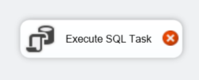

>
>
>Universidad San Carlos de Guatemala
>
>Facultad de Ingeniería 
>
>Escuela de Ciencias y Sistemas 
>
>Primer Semestre, 2025
>
>Laboratorio de Seminario de Sistemas 2

| Nombre                               | Carnet    |
| ------------------------------------ | --------- |
|   &nbsp; Melyza Alejandra Rodríguez Contreras | 201314821 |

# Proyecto 1

## Descripción general 

>  

>***SG-Food***, una megaempresa dedicada a la compra, distribución y comercialización de productos de diversas marcas y categorías que requiere una solución de *Business Intelligence* para optimizar sus procesos de análisis de ventas e inventarios. Debido al crecimiento significativo en sus operaciones, el sistema actual presenta tiempos de respuesta lentos y problemas en la base de datos principal. Este proyecto propone implementar una solución de BI que optimice los tiempos de respuesta y reduzca la carga sobre la base de datos central, permitiendo un análisis eficiente de datos de compras y ventas.

## Arquitectura de la solución 

## Tecnologías utilizadas 

| Tecnología | Versión | Descripción | 
| -- | -- | -- |
| | | |
| | | |
| | | |
| | | |
| | | |
| | | |
| | | |

## Proceso ETL 

### Orígen de datos 
### Estrategia de tablas pivote 

Para hacer más sencillo el proceso ETL, se utilizó la estrategia de creación de tablas *pivote*, estas tablas se definen como herramientas auxiliares que nos ayudarán a realizar de mejor manera el proceso de transformación. 

### Extracción de datos

- **Herramientas utilizadas**

**Execute SQL Task**

 

### Transformación de datos
### Carga de datos 

## Modelo de DataWarehouse

## Manual de implementación 
